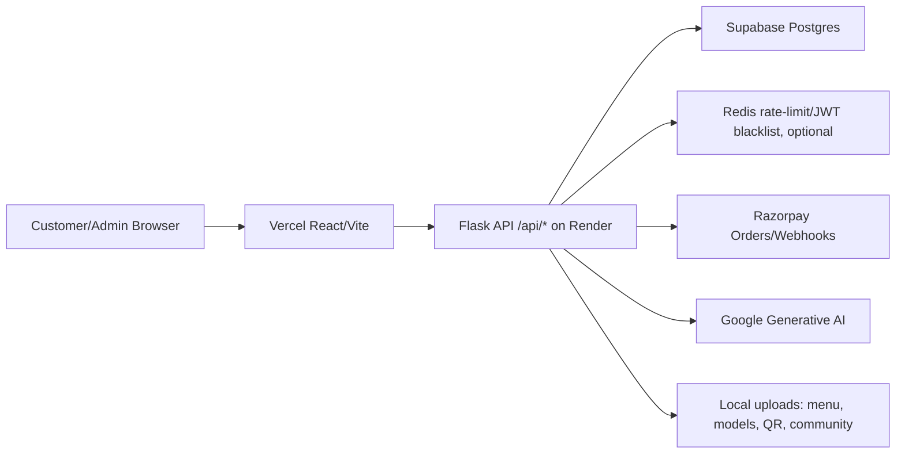

# Jaya Dhaba Security Assessment

Assessment date: 2026-05-30  
Target scope reviewed: React/Vite frontend, Flask API, Supabase/Postgres schema hardening, Razorpay payment flow, deployment headers/configuration.  
Testing mode: local static review plus focused local API tests. No active production scanning, brute forcing, destructive payloads, live payment manipulation, or production data modification was performed.

## Executive Summary

The application already contains several strong controls: CSRF protection, role decorators on admin routes, server-side order total calculation, Razorpay signature checks, webhook replay handling, strict response headers, refresh-token rotation, and local tests for IDOR/payment replay/expired JWTs. The remaining risk is concentrated around operational trust boundaries and token handling: privileged SSE endpoints accept JWTs in URLs, rate limiting/audit identity trusts client-supplied forwarding headers unless the origin is perfectly shielded, JWTs contain user PII, and the Supabase hardening migration leaves a `SECURITY DEFINER` trigger function in the exposed `public` schema.

| Severity | Count |
| --- | ---: |
| Critical | 0 |
| High | 0 |
| Medium | 4 |
| Low | 3 |
| Informational | 2 |

## Attack Surface Map



Public endpoints observed include `GET /api/menu`, `POST /api/orders`, `POST /api/reservations`, `POST /api/contact`, `POST /api/chat`, `GET /api/csrf-token`, `GET /api/orders/{id}` with public token, and `POST /api/payments/webhook`. Admin/staff endpoints are under `/api/admin/*`, `/api/kitchen/*`, and staff menu upload/update routes.

Technology fingerprint from repo:

| Layer | Technology |
| --- | --- |
| Frontend | React, Vite, Vercel headers |
| Backend | Flask 3.1.3, Flask-JWT-Extended, SQLAlchemy, Gunicorn/Eventlet |
| Database | Supabase/Postgres in production, SQLite in tests |
| Payments | Razorpay Python SDK |
| Auth | JWT access token plus HttpOnly refresh cookie |
| Security | CSRF double-submit cookie, CSP/HSTS, Redis/in-memory rate limits |

## Findings

### FINDING #1: Privileged JWT Accepted In Query String For SSE/Admin Streams

Severity: Medium  
CVSS Score: 6.5 - `CVSS:3.1/AV:N/AC:L/PR:L/UI:N/S:U/C:H/I:N/A:N`  
CWE: CWE-598 - Use of GET Request Method With Sensitive Query Strings  
Endpoint: `/api/kitchen/stream`, `/api/kitchen/orders`, `/api/reservations/stream`, `/api/orders/{id}/stream`  
Auth Required: Yes - staff/customer token depending on stream

Description:
Staff stream routes accept `access_token` from the URL query string. URLs are commonly captured in browser history, reverse-proxy logs, monitoring tools, analytics, and `Referer` headers, so a bearer token in the URL has a higher leakage risk than an `Authorization` header.

Proof of Concept:

```bash
curl -i "https://api.jayadhaba.online/api/kitchen/orders?access_token=$STAFF_JWT"
```

Evidence:
The query-token path is implemented in [backend/auth.py](../backend/auth.py) lines 158-172 and used by [backend/routes/sse.py](../backend/routes/sse.py) lines 61-85.

Impact:
If a staff JWT appears in logs or browser history, an attacker with log access can replay it until expiry/revocation and read live kitchen/order data.

Root Cause:
SSE compatibility was implemented by accepting bearer tokens in URLs.

Recommended Fix:
Remove `allow_query_token=True` for staff/admin streams. Prefer cookie-authenticated EventSource with strict SameSite/CSRF design, or use a short-lived one-time stream ticket created by an authenticated POST and bound to user/session/IP with a 30-60 second TTL.

References:
OWASP API Security - API2 Broken Authentication; CWE-598.

### FINDING #2: Rate Limiting And Audit Identity Trust Client-Controlled `X-Forwarded-For`

Severity: Medium  
CVSS Score: 6.5 - `CVSS:3.1/AV:N/AC:L/PR:N/UI:N/S:U/C:L/I:L/A:L`  
CWE: CWE-290 - Authentication Bypass by Spoofing; CWE-307 - Improper Restriction of Excessive Authentication Attempts  
Endpoint: Global API throttling, login throttling, audit logging  
Auth Required: No

Description:
Multiple helpers derive the client IP directly from `X-Forwarded-For`. This is only safe if Cloudflare/Render is the sole inbound path and the platform always appends a trusted hop. If the Render origin is reachable directly or a proxy misconfiguration occurs, attackers can rotate the header to evade per-IP limits and poison audit logs.

Proof of Concept:

```bash
for i in $(seq 1 20); do
  curl -i "https://api.jayadhaba.online/api/auth/login" \
    -H "X-Forwarded-For: 198.51.100.$i" \
    -H "Content-Type: application/json" \
    -H "X-CSRF-Token: $CSRF" \
    -b "csrf_token=$CSRF" \
    --data '{"login":"victim@example.com","password":"WrongPass123!"}'
done
```

Evidence:
IP parsing appears in [backend/security_middleware.py](../backend/security_middleware.py) lines 10-14, [backend/auth.py](../backend/auth.py) lines 95-99, [backend/app.py](../backend/app.py) line 418, and [backend/audit.py](../backend/audit.py) lines 11-13.

Impact:
An attacker may bypass IP-based throttles on public endpoints and make audit trails misleading if they can reach the app without a trusted proxy normalizing forwarding headers.

Root Cause:
The application trusts a request header that can be supplied by clients.

Recommended Fix:
Only trust forwarded headers from known proxy IP ranges. Configure Flask with a strict trusted-proxy middleware, prefer platform-provided client IP metadata when available, block direct origin access except Cloudflare/known egress, and use `CF-Connecting-IP` only after verifying the request came through Cloudflare.

References:
OWASP Logging Cheat Sheet; CWE-290; CWE-307.

### FINDING #3: JWT Access Tokens Contain PII Claims

Severity: Medium  
CVSS Score: 5.3 - `CVSS:3.1/AV:N/AC:L/PR:L/UI:N/S:U/C:L/I:N/A:N`  
CWE: CWE-359 - Exposure of Private Personal Information  
Endpoint: `/api/auth/login`, `/api/auth/register`, `/api/auth/refresh`  
Auth Required: Yes, user token

Description:
Access and refresh tokens include `email` and `phone` claims. JWT payloads are base64url-encoded, not encrypted, so any token leak exposes user contact information even if the signature remains secure.

Proof of Concept:

```bash
TOKEN="$(curl -s https://api.jayadhaba.online/api/auth/login \
  -H "Content-Type: application/json" \
  -H "X-CSRF-Token: $CSRF" \
  -b "csrf_token=$CSRF" \
  --data '{"login":"user@example.com","password":"CorrectPass123!"}' | jq -r '.access_token')"
python - <<'PY'
import base64, json, os
token = os.environ["TOKEN"]
payload = token.split(".")[1] + "=="
print(json.dumps(json.loads(base64.urlsafe_b64decode(payload)), indent=2))
PY
```

Evidence:
Claims are set in [backend/auth.py](../backend/auth.py) lines 203-208.

Impact:
If a token leaks through logs, browser memory, a support screenshot, or a compromised device, it discloses PII beyond the authorization secret itself.

Root Cause:
Convenience profile fields were embedded into bearer tokens.

Recommended Fix:
Keep JWT claims minimal: `sub`, `role`, `jti`, `iat`, `exp`, and possibly a session id. Fetch profile details from `/api/auth/me` instead. Do not store phone/email in refresh tokens.

References:
OWASP JWT Cheat Sheet; CWE-359.

### FINDING #4: Registration Response Enables Account Enumeration

Severity: Medium  
CVSS Score: 5.3 - `CVSS:3.1/AV:N/AC:L/PR:N/UI:N/S:U/C:L/I:N/A:N`  
CWE: CWE-203 - Observable Discrepancy  
Endpoint: `POST /api/auth/register`  
Auth Required: No

Description:
Registration returns a distinct `409` message when an email or phone already exists. This lets an unauthenticated attacker confirm whether a customer or staff email/phone is registered.

Proof of Concept:

```bash
curl -i "https://api.jayadhaba.online/api/auth/register" \
  -H "Content-Type: application/json" \
  -H "X-CSRF-Token: $CSRF" \
  -b "csrf_token=$CSRF" \
  --data '{"email":"known@example.com","password":"CustomerPass123!"}'

# Expected observable response from code:
# HTTP/1.1 409
# {"success":false,"message":"User with this email or phone already exists"}
```

Evidence:
The distinct message is returned in [backend/routes/auth.py](../backend/routes/auth.py) lines 72-83.

Impact:
Valid account identifiers can be harvested and combined with password spraying, phishing, or credential stuffing.

Root Cause:
The register flow exposes account existence through a user-facing error.

Recommended Fix:
Return a generic response such as “If this registration can be completed, we will continue,” or move duplicate-account handling to an email/OTP verification flow. Keep detailed duplicate diagnostics server-side only.

References:
OWASP Authentication Cheat Sheet; CWE-203.

### FINDING #5: Supabase Migration Creates `SECURITY DEFINER` Function In Exposed `public` Schema

Severity: Low  
CVSS Score: 3.7 - `CVSS:3.1/AV:N/AC:H/PR:L/UI:N/S:U/C:L/I:L/A:N`  
CWE: CWE-266 - Incorrect Privilege Assignment; CWE-732 - Incorrect Permission Assignment for Critical Resource  
Endpoint: Supabase/Postgres migration `004_supabase_rls_fortress.sql`  
Auth Required: Database role dependent

Description:
The migration creates `public.audit_orders_changes()` as `SECURITY DEFINER`. Supabase guidance recommends keeping privileged functions out of exposed schemas and explicitly revoking execute privileges.

Proof of Concept:

```sql
SELECT n.nspname, p.proname, p.prosecdef,
       has_function_privilege('anon', p.oid, 'EXECUTE') AS anon_can_execute,
       has_function_privilege('authenticated', p.oid, 'EXECUTE') AS authenticated_can_execute
FROM pg_proc p
JOIN pg_namespace n ON n.oid = p.pronamespace
WHERE n.nspname = 'public'
  AND p.proname = 'audit_orders_changes';
```

Evidence:
The function is defined in [backend/database/migrations/004_supabase_rls_fortress.sql](../backend/database/migrations/004_supabase_rls_fortress.sql) lines 142-166.

Impact:
No direct exploit was proven from local review because it is a trigger function, but keeping privileged code in `public` increases blast radius if future grants, overloads, or function bodies change.

Root Cause:
The audit trigger function was placed in the exposed schema as a privileged definer function.

Recommended Fix:
Move the function to a private schema, set a minimal `search_path`, and explicitly revoke execution from `PUBLIC`, `anon`, and `authenticated`:

```sql
CREATE SCHEMA IF NOT EXISTS private;
ALTER FUNCTION public.audit_orders_changes() SET SCHEMA private;
REVOKE ALL ON FUNCTION private.audit_orders_changes() FROM PUBLIC, anon, authenticated;
```

References:
Supabase RLS/security guidance; CWE-266.

### FINDING #6: Production Can Boot With Razorpay Webhook Secret Missing

Severity: Low  
CVSS Score: 3.7 - `CVSS:3.1/AV:N/AC:L/PR:N/UI:N/S:U/C:N/I:N/A:L`  
CWE: CWE-16 - Configuration  
Endpoint: `/api/payments/webhook` and production config validation  
Auth Required: No

Description:
The local `.env` check found `RAZORPAY_WEBHOOK_SECRET` absent, and production runtime validation intentionally does not fail boot when the webhook secret is missing. The webhook endpoint rejects events when the secret is missing, which is secure against forged webhooks but can break asynchronous payment reconciliation.

Proof of Concept:

```bash
# Local config state observed during assessment:
# RAZORPAY_WEBHOOK_SECRET=absent

curl -i "https://api.jayadhaba.online/api/payments/webhook" \
  -H "Content-Type: application/json" \
  --data '{"event":"payment.captured","payload":{"payment":{"entity":{"id":"pay_fake"}}}}'
```

Evidence:
Webhook rejection occurs in [backend/routes/payments.py](../backend/routes/payments.py) lines 784-797. Production validation requires Razorpay key id/secret but does not require the webhook secret in [backend/app.py](../backend/app.py) around the Razorpay configuration checks.

Impact:
Real Razorpay events will be dropped until the secret is configured, which can leave paid orders unreconciled if client-side verification is interrupted.

Root Cause:
Webhook secret validation is endpoint-local rather than a required production boot check.

Recommended Fix:
Fail production boot when `RAZORPAY_WEBHOOK_SECRET` is empty, or explicitly disable webhook-dependent flows with a dashboard health alert. Add a deployment smoke check that posts a signed test webhook.

References:
Razorpay webhook signature verification; CWE-16.

### FINDING #7: Root Vercel CSP Allows Inline Scripts And Wildcard Render Connections

Severity: Low  
CVSS Score: 3.7 - `CVSS:3.1/AV:N/AC:H/PR:N/UI:R/S:U/C:L/I:L/A:N`  
CWE: CWE-693 - Protection Mechanism Failure  
Endpoint: Frontend deployment headers  
Auth Required: No

Description:
The root `vercel.json` CSP allows `'unsafe-inline'` in `script-src` and permits `https://*.onrender.com`/`wss://*.onrender.com` in `connect-src`. The nested `frontend/vercel.json` is stricter, but the root config appears to be the deployment config for the Vercel build.

Proof of Concept:

```bash
curl -I "https://jayadhaba.online" | grep -i content-security-policy
```

Evidence:
The weaker CSP is present in [vercel.json](../vercel.json) line 9. The stricter CSP appears in [frontend/vercel.json](../frontend/vercel.json) lines 33-35.

Impact:
Inline script allowance reduces XSS defense-in-depth, and wildcard Render connections may permit accidental direct-origin use from the browser if a Render preview/origin URL leaks.

Root Cause:
Two CSP definitions exist with different strictness.

Recommended Fix:
Make the root deployment CSP match the stricter frontend CSP. Remove `'unsafe-inline'` from `script-src`, prefer hashes/nonces, and restrict `connect-src` to the canonical API domain unless a specific Render health origin is intentionally required.

References:
OWASP CSP Cheat Sheet; CWE-693.

## Verified Strengths

The focused local suite passed: 19 tests green across `backend/tests/test_security.py` and `backend/tests/test_api.py`.

Verified by tests:

| Control | Evidence |
| --- | --- |
| CSRF enforced on mutations | `test_csrf_protection` |
| Security headers emitted | `test_security_headers` |
| Non-JSON API mutations rejected | `test_api_mutations_reject_form_content_type` |
| Expired JWT rejected | `test_jwt_expired_rejected` |
| Refresh token not returned in JSON body | `test_refresh_token_not_in_response_body` |
| Logout revokes DB session | `test_logout_revokes_db_session` |
| IDOR blocked for another customer order | `test_idor_blocked` |
| Razorpay invalid webhook signature rejected | `test_razorpay_bad_signature_rejected` |
| Razorpay replay does not duplicate payment | `test_payment_replay_blocked` |
| Payment verify requires server-created attempt | `test_checkout_verify_requires_server_created_attempt` |
| Failed webhook keeps order retryable | `test_razorpay_failed_webhook_keeps_order_retryable` |

## Attack Chain Scenarios

1. Account enumeration plus weak external password hygiene: `POST /api/auth/register` reveals valid identities. If rate limits can be bypassed through direct origin access and spoofed forwarding headers, an attacker can improve password-spray targeting.

2. Query-string staff token leakage plus permissive stream token handling: a staff token captured in access logs can be replayed against `/api/kitchen/orders?access_token=...` until expiry.

3. Weak deployment shielding plus header trust: if `jaya-dhaba.onrender.com` or another direct Render URL is reachable, Cloudflare protections can be bypassed and application-level rate-limit keys can be spoofed.

## Remediation Priority Matrix

| Priority | Window | Items |
| --- | --- | --- |
| Critical | 24 hours | None identified in local/code review |
| High | 7 days | Confirm direct Render origin is blocked; enforce trusted proxy IP handling |
| Medium | 30 days | Remove URL tokens from SSE/admin streams; remove PII from JWTs; make registration responses generic |
| Low/Info | 90 days | Move Supabase definer function to private schema; unify CSP; make webhook secret a production boot requirement |

## Tools Used

| Tool | Purpose | Result |
| --- | --- | --- |
| PowerShell file inspection | Route/config/static review | Completed |
| ripgrep (`rg`) | Secret/path/security-pattern discovery | Completed |
| pytest via `.venv` Python | Focused local security/API test verification | `19 passed` |
| Supabase security skill guidance | RLS/function placement review | Applied to migration review |

Commands used:

```powershell
rg -n 'upload|send_from_directory|subprocess|os\.system|eval\(|innerHTML|dangerouslySetInnerHTML|localStorage|sessionStorage|service_role|RAZORPAY|SUPABASE|VITE_|JWT_SECRET|SECRET_KEY|X-Forwarded-For|allow_query_token|access_token' .
.\.venv\Scripts\python.exe -m pytest backend\tests\test_security.py backend\tests\test_api.py
```

## Testing Limitations

Active production scans were not run. Specifically, I did not run subdomain enumeration, nuclei, ZAP active scan, sqlmap, request smuggling probes, brute-force tests, payment manipulation against live Razorpay, or any test that would create/modify production data.

Network validation of live headers, DNS, TLS, Cloudflare, Vercel/Render direct origin exposure, Supabase advisor output, and real Razorpay webhook delivery remains required before calling this a full production penetration test.

## Retest Recommendations

After fixes, retest these items:

1. Confirm `/api/kitchen/*` and `/api/reservations/stream` reject `?access_token=` and require the new stream-ticket or cookie-auth flow.
2. Confirm spoofed `X-Forwarded-For` does not change rate-limit keys or audit IPs unless the request arrived through a trusted proxy.
3. Decode new JWTs and verify no phone/email appears in access or refresh payloads.
4. Confirm duplicate registration returns the same externally visible response as a new registration.
5. Run the Supabase SQL PoC and verify no exposed `public` `SECURITY DEFINER` functions remain executable by `anon` or `authenticated`.
6. Confirm production refuses to boot without `RAZORPAY_WEBHOOK_SECRET`, or raises a release-blocking health check.
7. Run a live header check and confirm the deployed CSP has no `script-src 'unsafe-inline'`.

## Final Checklist

| Area | Check | Status |
| --- | --- | --- |
| Authentication | Login brute force locked/rate-limited | PASS locally, live proxy trust needs retest |
| Authentication | No user enumeration via registration | FAIL |
| Authentication | No user enumeration via login differences | PASS by code review for generic login errors |
| Authentication | JWT algorithm confusion rejected | PASS by Flask-JWT-Extended default, not live-tested |
| Authentication | JWT role tampering rejected | PASS by DB-backed role lookup |
| Authentication | Expired tokens rejected | PASS |
| Authentication | Tokens revoked after logout | PASS |
| Authentication | Refresh tokens single-use | PASS by rotation logic |
| Authentication | No sensitive info in JWT payload | FAIL |
| Injection | SQL injection payloads do not destroy/extract data | PASS locally for tested order payload |
| Injection | XSS payloads escaped in API stored text | PASS by code review for backend `raw_text`; browser rendering still needs live UI review |
| Injection | No SSTI/command injection | PASS by code review for reviewed routes |
| Authorization | Customer A cannot access Customer B order | PASS |
| Authorization | Regular user cannot access admin endpoints | PASS by role decorators/tests |
| Authorization | Mass assignment ignored/rejected | PASS by schema/field allowlists |
| Payments | Webhook invalid signature rejected | PASS |
| Payments | Payment amount re-verified against DB | PASS |
| Payments | Idempotency/replay handled | PASS |
| Payments | No negative/zero amount orders accepted | PASS by server-side totals |
| Infrastructure | Direct Render/Vercel origin cannot bypass Cloudflare | NOT TESTED |
| Infrastructure | No subdomain takeover | NOT TESTED |
| Infrastructure | CORS evil origin rejected | PASS by config review, live retest required |
| Infrastructure | No secrets in compiled bundles | NOT TESTED against production bundles |
| Infrastructure | Security headers present | PASS locally/config review |
| Infrastructure | No server version disclosure | NOT TESTED live |
| Rate limiting | Login/register/API limits present | PASS locally/config review |
| Rate limiting | X-Forwarded-For cannot bypass limits | FAIL until trusted proxy enforcement is added/verified |
